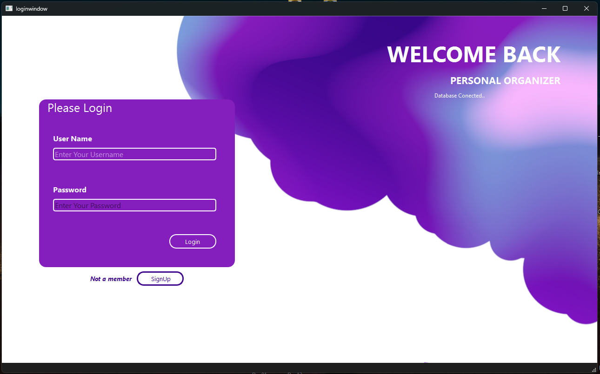
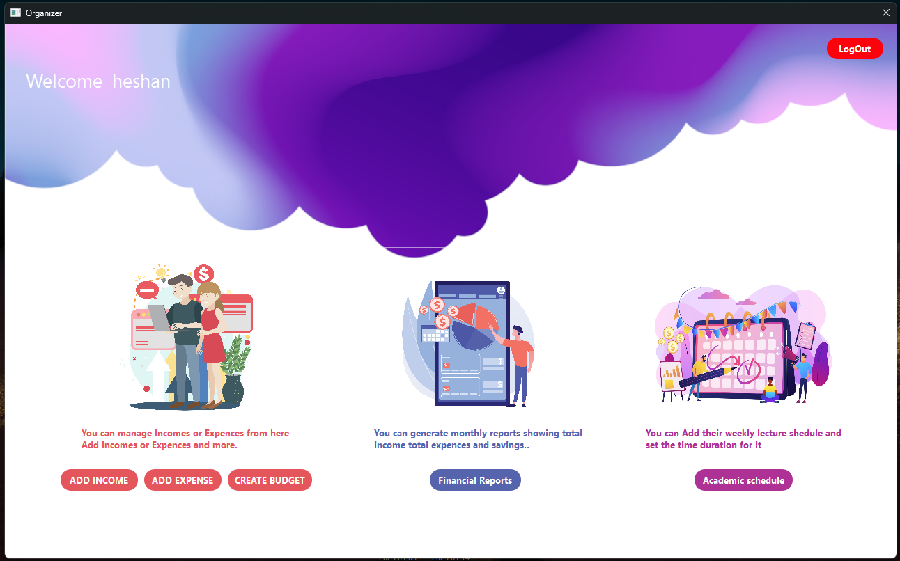

# 📚 Personal Organizer – OOP Mini Project

Welcome to my **Object-Oriented Programming (OOP) mini project**.  
This project is a **Personal Organizer App**, developed in **C++** using a GUI framework **Qt** . It helps students manage their **income, expenses, academic schedules, and deadlines** — all in one place!

---

## 🛠️ Project Features

### 👥 User Account System
- Users can sign up and log in using a username and password.
- All data is saved securely using DBMS.

### 💰 Income & Expense Tracker
- Add income from sources like jobs, scholarships, or allowance.
- Track expenses by category: Food, Entertainment, Traveling, Clothing, Equipment, University Fees, etc.
- Each entry includes date, description, category, and amount.

### 🎯 Budgeting by Category
- Set monthly spending limits for each category (e.g., Rs. 2000 for Entertainment).
- Get alerts when you exceed the set budget.

### 📊 Financial Reports
- Generate monthly financial reports showing:
  - Total Income
  - Total Expenses
  - Savings

### 🗓️ Academic Schedule Manager
- Add weekly lecture schedule with timings.
- Add and track important dates like assignment deadlines.
- Get reminders for upcoming deadlines and exams.

### 💾 Data Persistence
- Use DBMS  (e.g., SQLite) to save user data.

---

## 🖼️ Screenshots

### 🔐 Login Screen

### 🏠 Dashboard

### ➕ Add Income/Expense

### 📈 Financial Overview (Graph)

### 📅 Academic Schedule

---

## ⚙️ Tech Stack

- **Language**: C++
- **GUI Framework**: Qt
- **Data Storage**: SQLite
- **Graphing Tool**: -
- **Encryption**: -

---

## 🚀 How to Run

### Prerequisites
- C++ Compiler
- Qt Creator 
- Git

## 🧑‍💻 Author

**Name**: K.D.Heshan Rashmika  
**University**: Rajarata University of Sri Lanka 
**Course**: Object-Oriented Programming (OOP) -ICT1306
 **Instructor**: Mr. Akalanka Hettige  
**GitHub**: [@RashmikaKDH](https://github.com/RashmikaKDH)
